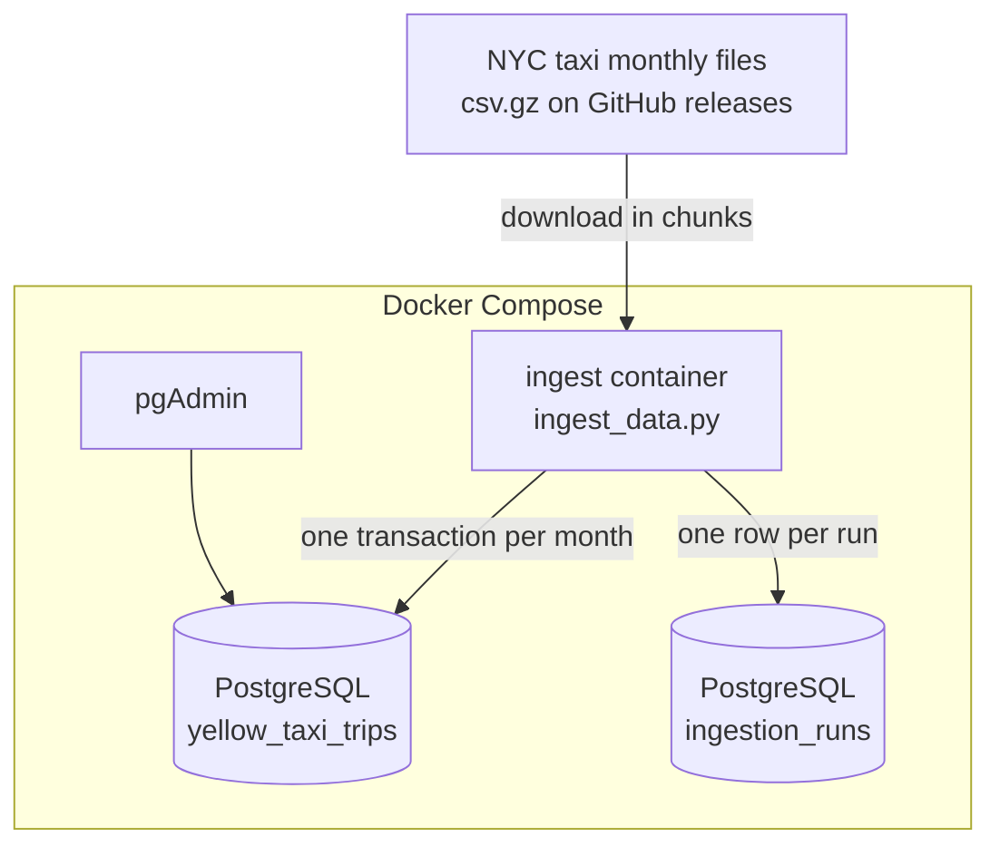

# NYC Taxi Batch Ingestion with Python, PostgreSQL and Docker

A containerised batch pipeline that downloads monthly NYC taxi trip files, loads them into PostgreSQL in chunks, and records every run. One command, `docker compose up`, starts the database, pgAdmin and the loader together.

> **Credit:** started while following week 1 of the [DataTalksClub Data Engineering Zoomcamp](https://github.com/DataTalksClub/data-engineering-zoomcamp). The section [What I changed from the course](#what-i-changed-from-the-course) lists what I rebuilt afterwards.

## Tech stack

Python · pandas · SQLAlchemy · PostgreSQL · Docker · Docker Compose · pgAdmin

## Architecture



## How it works

For each requested month, `ingest_data.py`:

1. Streams the compressed CSV in chunks of 100,000 rows, so a 1.4-million-row month never sits in memory at once.
2. Applies explicit column types and parses the pickup and dropoff timestamps, so every chunk gets the same types.
3. Opens one database transaction, deletes any rows already loaded for that month, then appends every chunk with a `source_month` column.
4. Commits, and writes a row to `ingestion_runs` with the month, row count, status and timings.
5. Exits with an error code if any month failed, so a scheduler can tell the run didn't succeed.

## Design decisions

- **Safe to re-run.** Loading a month first removes that month's existing rows, inside the same transaction as the new load. Running the same month twice replaces it rather than duplicating it, and a failed load rolls back completely.
- **Incremental by month.** Months are loaded independently, so adding a new month doesn't reload the earlier ones.
- **A run log in the database.** `ingestion_runs` records every attempt, including failures and their error messages, so you can see what was loaded and when without reading logs.
- **No credentials in code.** Database settings come from environment variables in a `.env` file, which `.gitignore` keeps out of the repo.
- **Startup order handled.** The loader waits for a Postgres health check before starting, instead of failing because the database isn't ready yet.

## Repository structure

```
├── ingest_data.py        # the loader
├── Dockerfile            # image for the loader
├── docker-compose.yaml   # Postgres + pgAdmin + loader
├── requirements.txt
├── .env.example          # settings to copy into .env
└── sql/
    └── verify_load.sql   # checks to run after a load
```

## How to run

1. Install Docker, then copy the settings file and change the passwords:
   ```bash
   cp .env.example .env
   ```
2. Start everything. This loads the months set in `.env` (January to March 2021 by default):
   ```bash
   docker compose up --build
   ```
3. Open pgAdmin at http://localhost:8080, log in with the pgAdmin details from `.env`, and add a server with host `pgdatabase` and the Postgres details from `.env`.
4. Run the queries in `sql/verify_load.sql` to check the load.

To load other months later without restarting everything:
```bash
docker compose run --rm ingest --year 2021 --months 4 5 6
```

Data available: yellow and green taxis, 2019 to 2021.

## What I changed from the course

- **Fixed the data source.** The original script downloaded CSV files the NYC TLC website no longer publishes, so it no longer ran. It now reads the archived monthly files.
- **Made loads idempotent and transactional.** The original replaced the whole table and appended chunks with no transaction, so a re-run or a failure halfway left duplicate or partial data.
- **Added multi-month loading and a run log.**
- **Moved credentials out of the command line** into environment variables. Passwords on the command line end up in shell history.
- **Removed the shell call to `wget`.** pandas now reads the URL directly, with nothing passed to a shell.
- **Rebuilt the Docker setup:** a current Python image with cached dependency installs, and the loader added as a Compose service that waits for a database health check.
- **Added verification queries** for row counts, run history and basic data quality.

## Limitations and next steps

- **Runs on demand.** Scheduling with cron or an orchestrator such as Airflow or Kestra would load each new month automatically.
- **Loads raw data only.** The checks in `sql/verify_load.sql` report issues such as mis-dated trips but don't fix them. A transformation layer (for example dbt) would clean and model the data.
- **Large months are slow through pandas.** PostgreSQL's `COPY` command would load much faster at bigger volumes.
